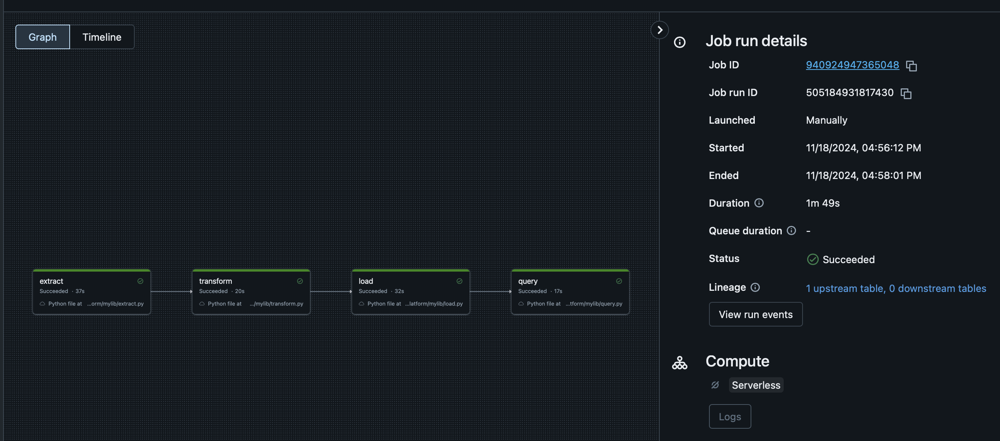

# IDS-706 Data Engineering Assignment
## Mini Project 11 : Using the Databricks Platform

#### Status(CI/CD) badge 

---------
### Proejct Purpose

- The purpose of this project is to build ETL-Query (Extract, Transform, Load, Query) pipeline via Python and Databricks
- I imported employee attrition dataset and pass it into a Databricks Delta table
- I established a connection Databricks and transform the data, building required data processing via SparkSQL queries

-----

### Requirements

* ***Create a data pipiline using Databricks***
* ***Include at least one data source and one data sink***

### Deliverables

* ***Databricks notebook or script***
* ***Document demonstrating the pipeline***

--------

### Preperation
* Setting up Databricks - GitHub connection via API access tokens 
* Dataset : 'Employee Attrition data' provided by IBM (reusing the path uploaded in the previous repository)

### Process

* `extract` : Downloads a dataset from a specified URL, cleans column names, and saves it as a Delta table in a specified Databricks DB.
* `transform` : Handles missing values, saves cleaned the data as a new Delta table, and exports it to DBFS for data sink.
* `load` : Checks if the table exists in a Databricks DB and, executes queries and displays the results using Spark. 
* `query` : Filters selected columns from a table and saves the result as a new Delta table in a Databricks DB.

### Workflow
* 

### Remarks
* Both `lib.py` and `main.py` generated logs. However, because the same process was repeated in `main.py`, this caused partial duplication in the log. To address this, `main.py`, deleted previous and rewrite the log.

